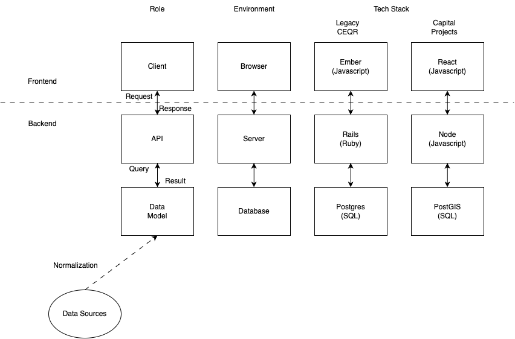
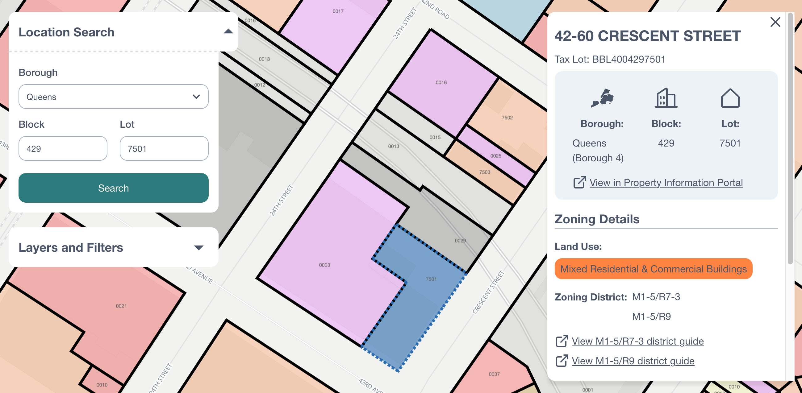

# Web development 101
A key part of collaboration is establishing a shared mental model. This is an introduction to the parts and approaches involved in web development.
This intention is to provide a mental framework for teams to share as we build together. We will begin with an overview of the parts and then share an example of the approaches.

## Overview
There are often three core components to a web application. Figure 1 shows three different perspectives of these same components. The first perspective is the role the component plays within the application. The second perspective is the physical environment in which the component operates. The final perspective is the software tool used to achieve the role. The suite of software tools used together are collectively known as a "Tech Stack". Figure 1 intentionally stacks the component vertically to make the term feel more appropriate. Software has evolved significantly over the last few years. Consequently, there is a divergence between the tech stack used around 2019 when CEQR app was first started and the tech stack Application Engineering used in 2024 to build proof of concept applications (which include the Capital Projects web tool).

The foundational component is the data model. The content and structure of the data model determines the information available within the application. The data model is contained within a database. The CEQR application leverages Postgres for its database. In 2024, we are still using Postgres. However, we have added an extension called PostGIS that provides spatial analysis capabilities. 

The API component is built on top of the data model. It constructs queries, or asks questions, of the data model. It determines what information we are actually extracting from the data model. The API runs on a server, typically hosted by a service like AWS or Azure. CEQR currently uses a framework known as "Rails" written in the "Ruby" language. Going forward, Application Engineering aims to use "Node", allowing us to coalesce around tools written in the "Javascript" language. Together, the Data Model and the API constitute the "Backend" of the application. 

Finally, the client provides a user interface to the information. It "requests" information from the API and the API will "respond" accordingly. The client then presents this data in an easier-to-digest format. It constitutes the frontend and it runs in the user's web browser. The current CEQR application uses the "Ember" framework. Application Engineering is moving towards the "React" library. Both "Ember" and "React" are written with "Javascript". However, for reasons outside the scope of this introduction, Application Engineering is moving towards "React".

In addition to the three core components, we also need to consider our data sources and how they related to our data model. This consideration is generally known as "Normalization". It is one of several web application design steps.

   
Figure 1: Core components of a web application

## Design
For each component of our web application, we need to consider how to design it for current and anticipated user needs. In the next few sections, we will follow an example feature through the design process.

Let's consider the case of wanting to show users zoning districts associated with a tax lot- a feature currently offered by ZoLa. We'll follow the design of this feature through each of the web application components.

### Data model

As discussed earlier, the application's foundation is the data model. The data model itself comes from data sources across the city. Pluto contains the information needed for our feature.
In Figure 2, we see that pluto has the bbl of the tax lot and lists up to four zoning districts into which that tax lot may fall. We could use the source data as-is and achieve the feature as described. However, our application will be rigid; it will be difficult to answer other questions. 

The data is rigid because it present the information primarily from the perspective of the tax lot. However, zoning districts are their own "entity". The "Normalization" process examines columns in a table. It is looking for data that actually represent separate entities. It then breaks these entities into their own tables, which have "relationships" with other entities in their own tables. When we normalize the pluto source, we realize there are actually three distinct entities. These ideas are tax lots, zoning districts, and zoning district classes.

A zoning district class represents the abstract policy around what development is allowed. A zoning district is the spatial extent of these policies. A class may actually be found in several districts. Correspondingly, a district may allow multiple classes. Tax lots exist under zoning districts. One tax lot may intersect several zoning districts. Normalizing the data reveals more depth of the complex relationships within the data.

In Figure 2, we see the tables for zoning districts and zoning district classes contain more fields than the original pluto source. This data is available in the build process for Pluto. However, Pluto is designed to be compact and flattens the data into a single table, removing non-tax lot information in the process. When we normalize the data, there is more room for these fields; we are able to keep it in the data model for the web application.

Our feature originally asked what zoning districts are associated with a tax lot. Answering this question with a normalized data model is slightly more complicated than using the flat source model. With the normalized model, we need to follow the relationship of the tax lots to the zoning districts. However, we are now able to ask more questions. These questions could be from a new perspective. In addition to finding the zoning districts for a tax lot, we can also find the tax lots in a zoning district. These questions could also tap into new information. We now have space to hold the geographic boundaries of each zoning district. For tax lots that intersect with multiple zoning districts, we can actually ask where those overlaps are.

   
Figure 2: Normalization of a data schema

### API design

The API is our gateway into the data model. We use it to structure our questions. These questions take the form of "endpoints". The client constructs "requests" to these endpoints and the API "responds" with the relevant data. Application Engineering implemented an API as part of its PoC applications. The documentation for this API is available at [https://zoning-api.nycplanningdigital.com/](https://zoning-api.nycplanningdigital.com/). The data model for the PoC is much larger than our example and there are numerous questions we can ask of the data. Fortunately, the data model for our feature is included in the data model for our feature and we can focus on the endpoints that answer the questions for our feature.

For our feature, let's find the zoning districts for tax lot `4004297501`. From the documentation, we can see the endpoint [`tax-lots/{bbl}/zoning-districts`](https://zoning-api.nycplanningdigital.com/#tag/Zoning-Districts/operation/findZoningDistrictsByTaxLotBbl) will return all of the zoning districts over a tax lot. We also don't need a client to get the data. We can navigate to [`tax-lots/4004297501/zoning-districts`](https://zoning-api.nycplanningdigital.com/api/tax-lots/4004297501/zoning-districts) in our browsers and see the data from the APIs response.

This first endpoint is enough to satisfy the feature request. But with our normalized data, we can also go a step further and see what development is allowed in each of these districts. The [`/zoning-districts/{id}/classes`](https://zoning-api.nycplanningdigital.com/#tag/Zoning-Districts/operation/findZoningDistrictClassesByZoningDistrictId) will tell us the classes of each zoning district. Let's take an id of the zoning districts returned by our previous request and look up the classes for that zoning district: [zoning-districts/94a33fe6-717f-4eed-b393-1fab3d85a1a6/classes](https://zoning-api.nycplanningdigital.com/api/zoning-districts/94a33fe6-717f-4eed-b393-1fab3d85a1a6/classes)

### Client design

Our API provides the necessary information to answer the core question of our feature. However, the experience is clunky. The client refines the interaction with the backend. Figure 3 shows a PoC user interface to find zoning districts for a tax lot. Users input their requested tax lot by either selected the borough, block, and lot in the dropdown or clicking on it in the map. After the user selects a tax lot, the client makes the requests for the user. When the API responds, the client nicely formats the data into a content panel.

   
Figure 3: User interface to find zoning districts for a tax lot

## Conclusion

NYC and DCP have talented data engineers and fantastic data resources. From these sources, we can construct a deep model of the city. On this deep model of the city, we can build APIs that answer our most pressing questions. As these questions evolve, we can evolve our APIs to ask new questions of our data model. We can then create clients that smooth the interaction with these APIs.

